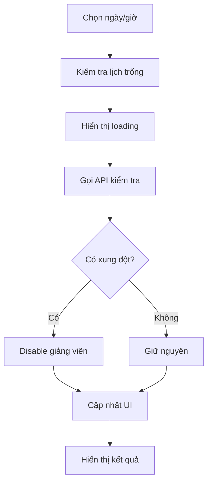

# Real-time Validation Demo - Defense Session Management

## Tính năng mới: Real-time Schedule Validation

### 🎯 Mục tiêu

Thay vì chỉ validate khi submit form, giờ đây hệ thống sẽ kiểm tra lịch trống của giảng viên **ngay khi người dùng chọn ngày/giờ**, và **disable các giảng viên bị vướng lịch**.

### ✨ Các tính năng đã thêm

#### 1. **Real-time Schedule Checking**

- Khi người dùng chọn ngày và giờ, hệ thống tự động kiểm tra lịch trống của tất cả giảng viên
- Hiển thị loading spinner trong quá trình kiểm tra
- Cập nhật danh sách giảng viên khả dụng ngay lập tức

#### 2. **Preventive Blocking**

- Giảng viên bị vướng lịch sẽ bị **disable** trong dropdown
- Không thể chọn giảng viên đã bị vướng lịch
- Hiển thị label "(Bị vướng lịch)" cho các giảng viên không khả dụng

#### 3. **Visual Feedback**

- **Màu đỏ** cho giảng viên bị vướng lịch
- **Loading indicator** khi đang kiểm tra
- **Thông báo số lượng** giảng viên bị vướng lịch
- **Cảnh báo** cho giảng viên đã chọn nhưng bị vướng lịch

#### 4. **Smart UI Updates**

- Dropdown placeholder thay đổi theo trạng thái
- Danh sách đã chọn hiển thị cảnh báo cho giảng viên bị vướng lịch
- Thông báo tổng quan được cập nhật với thông tin mới

### 🔧 Cách hoạt động

#### Bước 1: Chọn ngày và giờ

```
Người dùng chọn: 2024-01-15, 09:00 AM
↓
Hệ thống tự động kiểm tra lịch trống của tất cả giảng viên
↓
Hiển thị loading: "Đang kiểm tra lịch giảng viên..."
```

#### Bước 2: Cập nhật danh sách giảng viên

```
Giảng viên khả dụng:
✅ Nguyễn Văn A
✅ Trần Thị B
❌ Lê Văn C (Bị vướng lịch) - DISABLED
✅ Phạm Thị D
```

#### Bước 3: Chọn giảng viên

```
Người dùng chỉ có thể chọn giảng viên khả dụng
Giảng viên bị vướng lịch không thể chọn được
```

#### Bước 4: Feedback real-time

```
Nếu chọn giảng viên bị vướng lịch (từ trước):
⚠️ Nguyễn Văn A - Bị vướng lịch
```

### 📱 Giao diện người dùng

#### Trước khi chọn ngày/giờ:

```
[Dropdown giảng viên]
Chọn thành viên hội đồng (tối đa 3 người)
```

#### Khi đang kiểm tra:

```
[Dropdown giảng viên - Loading]
Đang kiểm tra lịch giảng viên...

[Thông báo loading]
🔄 Đang kiểm tra lịch trống của giảng viên...
```

#### Sau khi kiểm tra:

```
[Dropdown giảng viên]
Chọn thành viên hội đồng (tối đa 3 người)

[Thông báo cảnh báo]
⚠️ Có 2 giảng viên bị vướng lịch trong khung giờ này
Các giảng viên này sẽ không thể chọn được

[Danh sách giảng viên]
✅ Nguyễn Văn A
✅ Trần Thị B
❌ Lê Văn C (Bị vướng lịch) - DISABLED
✅ Phạm Thị D
```

### 🚀 Lợi ích

1. **Trải nghiệm người dùng tốt hơn**

   - Không cần submit form để biết lỗi
   - Feedback ngay lập tức
   - Ngăn chặn lỗi từ đầu

2. **Tiết kiệm thời gian**

   - Không cần thử nghiệm nhiều lần
   - Biết ngay giảng viên nào khả dụng
   - Giảm thiểu lỗi validation

3. **Tăng độ chính xác**
   - Dữ liệu real-time từ backend
   - Kiểm tra chính xác lịch trống
   - Tránh xung đột lịch

### 🔄 Luồng xử lý



### 🛠️ Technical Implementation

#### State Management:

```javascript
const [busyTeachers, setBusyTeachers] = useState(new Set());
const [checkingSchedule, setCheckingSchedule] = useState(false);
```

#### API Integration:

```javascript
const checkTeacherAvailability = async (teacherIds, date, time) => {
  // Tạo test session data
  // Gọi API validation
  // Trả về Set các teacher IDs bị vướng lịch
};
```

#### UI Updates:

```javascript
options={teacherOptions.map(option => ({
  ...option,
  isDisabled: busyTeachers.has(option.value),
  label: busyTeachers.has(option.value)
    ? `${option.label} (Bị vướng lịch)`
    : option.label
}))}
```

### 📋 Test Cases

1. **Chọn ngày/giờ có giảng viên khả dụng**

   - Tất cả giảng viên có thể chọn
   - Không có cảnh báo

2. **Chọn ngày/giờ có giảng viên bị vướng lịch**

   - Giảng viên bị vướng lịch bị disable
   - Hiển thị cảnh báo số lượng

3. **Thay đổi ngày/giờ**

   - Tự động kiểm tra lại
   - Cập nhật danh sách giảng viên

4. **Chọn giảng viên đã bị vướng lịch từ trước**
   - Hiển thị cảnh báo trong danh sách đã chọn
   - Vẫn có thể submit (backend sẽ validate)

### 🎉 Kết quả

Người dùng giờ đây có thể:

- ✅ Biết ngay giảng viên nào khả dụng
- ✅ Tránh chọn giảng viên bị vướng lịch
- ✅ Nhận feedback real-time
- ✅ Tiết kiệm thời gian và giảm lỗi
